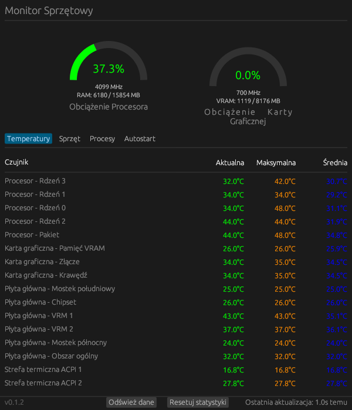

# lx-monitor

Linux Hardware Monitor - A modern system resource monitor for Linux (CPU, GPU, temperatures).



## Features

### Main Tabs
- **Temperatures** - Real-time temperature monitoring for all system components with current, maximum, and average values. Supports row selection.
- **Hardware** - Detailed system information including:
  - Operating System, Distribution, Version
  - Kernel Version, Architecture
  - Processor and CPU Configuration
  - Motherboard and BIOS
  - Graphics Card and GPU Driver
  - RAM (Total and Used)
- **Processes** - Process manager showing top 30 processes sorted by CPU usage with:
  - Process Name, PID, CPU %, Memory usage
  - Color-coded CPU usage (Green/Yellow/Red)
  - Row selection
  - Context menu to kill processes
- **Autostart** - Autostart program manager with:
  - Program name and status (Running/Not running)
  - Row selection
  - Context menu to open file location (supports Nautilus, Dolphin, Nemo, Thunar, PCManFM)

### Dashboard
- **CPU Gauge** - Visual CPU load indicator with:
  - CPU clock speed (MHz)
  - RAM usage (Total/Used in MB)
  - Color-coded load (Green/Yellow/Red)
- **GPU Gauge** - Visual GPU load indicator with:
  - GPU clock speed (MHz)
  - VRAM usage (Total/Used in MB)
  - Color-coded load (Green/Yellow/Red)
  - **AMD GPU only** (via sysfs - NVIDIA and other GPUs not supported)

### Additional Features
- **Multi-language support** - English and Polish (auto-detected from system locale)
- **Automatic data refresh** - CPU/GPU/temperatures every 1 second, processes every 3 seconds
- **Manual refresh** - Button to refresh data on demand
- **Reset statistics** - Button to reset maximum temperatures and statistics
- **Row selection** - Click to select rows in Temperatures, Processes, and Autostart tabs
- **Context menus** - Right-click for additional actions (kill processes, open file locations)
- **Footer information** - Version number (v0.1.2) and last update time
- **Root privileges** - Runs with elevated permissions via pkexec for hardware access

## Installation

### Arch Linux (AUR)
You can build and install using the provided `PKGBUILD`:
```bash
makepkg -si
```

### Manual Build
Ensure you have Rust installed and the following system dependencies:
`libx11`, `libxi`, `libxcursor`, `libxrandr`, `libxinerama`, `libxkbcommon`, `pciutils`.

```bash
cargo build --release
```

## License
MIT
